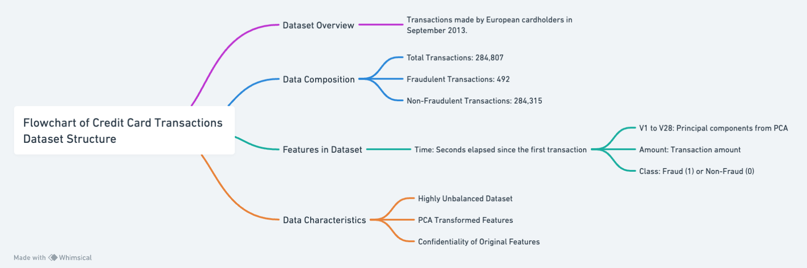

# Data Description

This dataset contains credit card transactions from European cardholders in September 2013. It includes a total of 284,807 transactions over two days, with 492 identified as fraudulent, representing approximately 0.172% of the total transactions. The dataset is highly unbalanced, emphasizing the rarity of fraud occurrences.

The data features are primarily numerical, derived from a Principal Component Analysis (PCA) transformation. Due to confidentiality, the original features are not disclosed. The variables V1 to V28 are the principal components obtained through PCA. The dataset also includes 'Time' and 'Amount' features, which are not transformed. 'Time' indicates the seconds elapsed between each transaction and the first transaction in the dataset. 'Amount' represents the transaction amount and can be used for cost-sensitive learning. The 'Class' variable is the response attribute, indicating fraud (1) or non-fraudulent (0) transactions.

# Data Processing and Enhancement

## Scaling and Cleaning
- **Amount Scaling:** The 'Amount' feature has been scaled using RobustScaler to minimize the influence of outliers. This scaling makes the feature more suitable for our analytical models.
- **Time and Amount Columns:** Original 'Time' and 'Amount' columns have been removed to focus on the transformed features and the newly scaled 'Amount'.
- **Missing Values:** The dataset has been checked for missing values to ensure the integrity and quality of the data.

## Balancing the Dataset
- **SMOTE (Synthetic Minority Over-sampling Technique):** To address the issue of imbalance in the dataset, SMOTE has been applied, resulting in a balanced dataset with equal representation of fraudulent and non-fraudulent transactions. This processed data has been saved as 'processed_data_1_1.csv' to 'processed_data_1_10.csv'.
- **Random Under Sampling:** Additionally, RandomUnderSampler has been used to balance the dataset through under-sampling. This alternative balanced dataset is stored as 'processed_data_2.csv'.

# Data Dictionary

| Variable | Description | Type | Range/Values |
|----------|-------------|------|--------------|
| Time     | Time elapsed in seconds between each transaction and the first transaction in the dataset. | Numerical | Continuous |
| V1 - V28 | Principal components obtained from PCA. Due to confidentiality, the original features and more background information about the data are not provided. | Numerical | Continuous |
| Amount   | Transaction amount. This feature can be used for example-dependent cost-sensitive learning. | Numerical | Continuous |
| Class    | Indicates fraud (1) or non-fraudulent (0) transactions. | Categorical | 0 (Non-Fraud), 1 (Fraud) |

# Sample Data

| id | Time |    V1   | V2     | V3     | V4     | ... | V28    | Amount | Class |
|----|------|---------|--------|--------|--------|-----|--------|--------|-------|
| 0  | 0.0  |  2.074  | -0.129 | -1.137 | 0.413  | ... | -0.060 | 1.98   | 0     |
| 1  | 0.0  |  -1.808 | 1.795  | -2.575 | -1.944 | ... | 0.848  | 8.00   | 1     |
| 2  | 0.0  |  0.092  | 1.005  | -0.223 | -0.435 | ... | 0.087  | 2.69   | 0     |
| 3  | 0.0  |  1.980  | -0.185 | -1.064 | 0.120  | ... | -0.074 | 1.00   | 0     |
| 4  | 0.0  |  1.026  | -0.172 | 1.204  | 1.244  | ... | 0.021  | 1.00   | 0     |

# Flowchart of Dataset Structure

## Reference
- Walter Reade, Ashley Chow. (2023). Binary Classification with a Tabular Credit Card Fraud Dataset. Kaggle. https://kaggle.com/competitions/playground-series-s3e4

