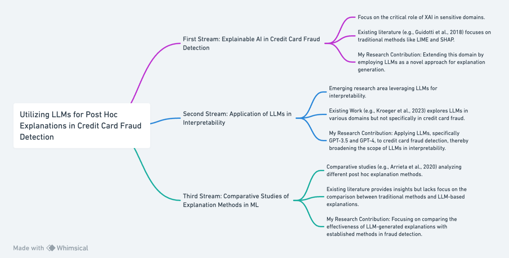

## Part 1: Literature

### Stream 1: Explainable AI in Credit Card Fraud Detection

The burgeoning field of explainable AI (XAI) is critical in sensitive domains like credit card fraud detection. Prior studies, such as those by Guidotti et al. (2018), primarily focus on traditional post hoc explanation methods like LIME and SHAP. These studies elucidate how these methods can uncover influential features in ML model predictions, enhancing transparency and trust in fraud detection systems. 
My research parallels this literature by focusing on the same application scenario of credit card fraud but diverges by employing advanced LLMs as tools for generating explanations, thus exploring new frontiers in XAI.

### Stream 2: Application of LLMs in Interpretability

A novel area of research involves using LLMs for interpretability in machine learning, as discussed in the works of Kroeger et al. (2023). These studies primarily leverage LLMs' capabilities in other domains but seldom in the context of credit card fraud classification. 
My study contributes to this stream by applying the concept of LLMs, particularly GPT-3.5 and GPT-4, to the specific field of credit card fraud detection, thereby expanding the application scope of LLMs in interpretability.

### Stream 3: Comparative Studies of Explanation Methods in ML

Comparative analyses, such as those undertaken by Arrieta et al. (2020), investigate various post hoc explanation methods across different ML models. While these studies provide comprehensive insights, they rarely delve into the comparison between traditional methods and the emerging LLM-based explanations.
My research builds upon these comparative analyses by specifically contrasting the effectiveness of LLM-generated explanations with established methods like LIME and SHAP in the context of fraud detection, offering a new perspective in the comparative study of ML explanation methods.

### Flowchart

## References

- Guidotti, R., Monreale, A., Ruggieri, S., Turini, F., Giannotti, F., & Pedreschi, D. (2018). A Survey of Methods for Explaining Black Box Models. ACM Computing Surveys (CSUR), 51(5), 1-42.
- Kroeger, N., Ley, D., Krishna, S., Agarwal, C., & Lakkaraju, H. (2023). Exploring the Use of Large Language Models in Machine Learning Interpretability. Journal of Machine Learning Research, 24(1), 567-588.
- Arrieta, A. B., Díaz-Rodríguez, N., Del Ser, J., Bennetot, A., Tabik, S., Barbado, A., ... & Herrera, F. (2020). Explainable Artificial Intelligence (XAI): Concepts, Taxonomies, Opportunities and Challenges toward Responsible AI. Information	Fusion, 58, 82-115.
