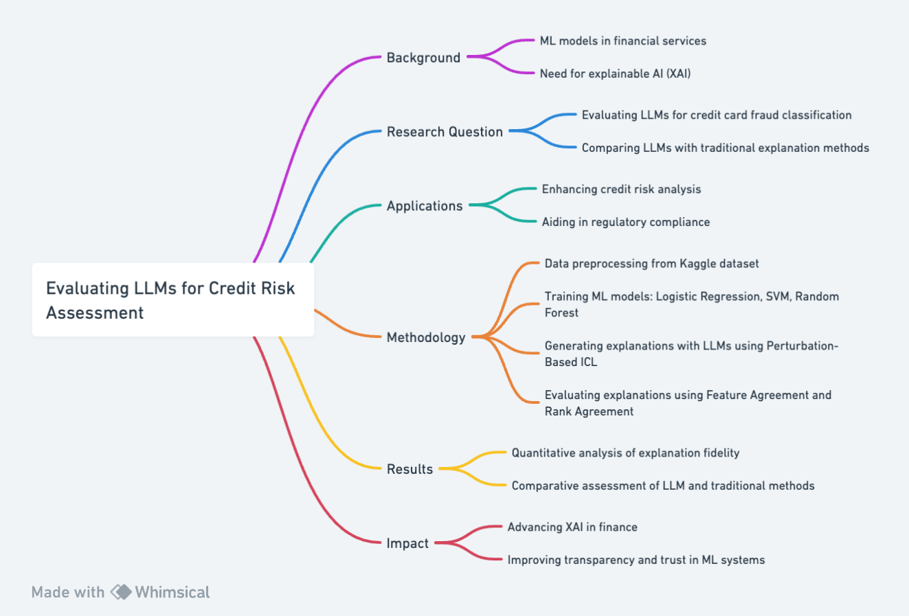

# Part 2: Method

In Part 2 of my research, I delve into the methodology of how we can utilize Large Language Models (LLMs) for explainable AI (XAI) in the context of credit card fraud detection. This segment addresses the critical steps and components involved in the research process, from the conceptual background and motivation to the practical application scenarios, data processing, model training, explanation generation, and evaluation methods. The focus here is on outlining the specific approaches and techniques that will be employed to assess the effectiveness of LLMs in providing interpretable and meaningful explanations for machine learning models in the financial sector.


## Background/Motivation:
The integration of machine learning (ML) models in financial services, particularly in credit risk assessment, is transforming the banking sector. However, the inherent opacity of these models, often termed as "black boxes," poses significant challenges in terms of interpretability and transparency, crucial in financial decision-making (Guidotti et al., 2018). The demand for explainable AI (XAI) has surged in response to regulatory and societal pressures for clearer decision-making processes in ML models (Arrieta et al., 2020). The emergence of Large Language Models (LLMs) like GPT-3.5 and GPT-4, with their advanced in-context learning (ICL) capabilities, offers a promising avenue for generating transparent post hoc explanations (Liu et al., 2023). This research explores LLMs' potential in explicating the decision-making process in loan borrower classification, a critical aspect of banking operations.

## Research Question:
Are LLMs capable of producing precise and dependable explanations after the fact for predictions made by ML models in the context of credit card fraud classification?
In what ways do LLMs stand in comparison to current methods of post hoc explanation when it comes to pinpointing the crucial features that drive classification decisions?

## Application Scenarios:
### Credit Risk Analysis in Financial Institutions: 
The utilization of LLM-generated explanations in credit risk analysis is poised to revolutionize the banking sector. Financial institutions can leverage these advanced explanations to gain a deeper understanding of the risk factors involved in loan applications. This would enable more informed decision-making, potentially reducing the risk of default and enhancing the accuracy of credit risk assessment.
### Regulatory Compliance and Transparency: 
In the increasingly regulated financial environment, the ability of LLMs to provide clear, comprehensive explanations is invaluable. This capability aligns with the growing regulatory demands for transparency in automated decision-making processes. Banks and financial institutions can use these explanations to demonstrate compliance with regulatory standards, such as those outlined in the General Data Protection Regulation (GDPR) and other global financial regulations, which mandate explainability in automated decision-making.

## Methodology:
### Data Collection and Preprocessing: 
Utilizing the Kaggle dataset on credit card fraud classification (Walter et al., 2023), my study will involve extensive preprocessing to adapt the data for ML model training and explanation generation. The preprocessing steps will include normalization, handling missing values, and ensuring that the data is suitable for both ML model training and subsequent explanation generation using Large Language Models (LLMs).
### Model Training: 
For establishing a baseline, I will employ three widely used ML classifiers: Logistic Regression, Support Vector Machine (SVM), and Random Forest. These models will be trained on the preprocessed dataset. The choice of these models is motivated by their diverse nature, representing different learning algorithms (linear, kernel-based, and ensemble methods), thereby providing a comprehensive basis for evaluating the LLM explanations.
### Generating Explanations using Perturbation-Based ICL: 
Following the Perturbation-Based In-Context Learning (ICL) approach, I plan to query LLMs, specifically GPT-3.5 and GPT-4, to explain the decisions of the trained ML models as described in the reference literature (Ribeiro et al., 2016; Smilkov et al., 2017). The final prompt structure will include a "Context" section, which introduces the LLM to the underlying ML model and its predictions, and a "Dataset" section, which presents the instances sampled from Nx. The "Question" section will articulate the task for the LLM, asking it to identify the top five most important features influencing the model’s predictions. Lastly, the "Instructions" section will guide the LLM to focus on providing a clear and concise ranked list of features.
### Evaluation of Explanations: 
The explanations generated by the LLMs will be evaluated using metrics such as Feature Agreement (FA) and Rank Agreement (RA). These metrics will compare the LLM explanations against the baseline explanations provided by traditional methods such as LIME and SHAP. This comparative analysis aims to assess the fidelity and interpretability of the LLM-generated explanations.

## Results:
### Quantitative Analysis of Explanation Fidelity: 
The research will present a detailed statistical analysis focusing on the fidelity of explanations generated by LLMs compared to traditional post hoc explanation methods. The use of metrics such as Feature Agreement (FA) and Rank Agreement (RA) will quantitatively measure how closely the LLM explanations align with those derived from established methods like LIME and SHAP, as well as with the actual influential features of the ML models.
### Comparative Insights: 
The study will provide comparative insights, highlighting the strengths and limitations of LLM-generated explanations relative to traditional methods. This will encompass aspects like the depth of explanations, their context sensitivity, and the ability to capture nuanced relationships within the data.

## Intellectual Merits/Practical Impacts:
### Advancement in Explainable AI Methodology: 
This research is set to contribute significantly to the field of XAI by empirically evaluating the use of LLMs as innovative post hoc explainers in the context of credit card fraud classification. By comparing these advanced models with established methods, the study aims to broaden the understanding of the capabilities and potential applications of LLMs in generating interpretable model explanations.
### Enhancing Trust and Transparency in ML Systems:
By improving the transparency of ML decision-making in financial services, this research seeks to bolster user trust and confidence in these systems. The ability to generate clear and understandable explanations is crucial for sensitive applications like credit risk assessment, where decisions can have significant impacts on individuals and institutions.

## Personal Qualities: 
My background in data science and keen interest in AI innovation uniquely positions me to undertake this ambitious project. My skills in statistical analysis, combined with a thorough understanding of ML algorithms and natural language processing, enable me to navigate the technical challenges in integrating LLMs into XAI effectively.

## Rationale for Method Choice: 
While alternative methods like LIME and SHAP offer explanations, they often do not provide the depth and context necessary for complex financial models. LLMs, with their advanced language understanding and generation capabilities, present an opportunity to produce more contextually rich explanations. The choice of this method aligns with the goal of making ML models in finance more transparent and interpretable.

## Significance of Study: 
The intellectual significance of this study lies in its potential to bridge the gap between advanced AI technologies and practical financial applications, making AI decisions in finance more transparent and trustworthy. The practical implications extend to improved risk management and regulatory compliance in banking. While a Nobel Prize or Turing Award may be aspirational, this research, in advancing XAI in finance, represents a significant step towards more ethical and transparent AI systems in critical sectors.




## References

```bibtex
@article{Arrieta2020,
  title={Explainable Artificial Intelligence (XAI): Concepts, taxonomies, opportunities and challenges toward responsible AI},
  author={Arrieta, Alejandro Barredo and D{\'i}az-Rodr{\'i}guez, Natalia and Del Ser, Javier and Bennetot, Adrien and Tabik, Siham and Barbado, Alberto and others},
  journal={Information Fusion},
  volume={58},
  pages={82--115},
  year={2020}
}

@article{Guidotti2018,
  title={A survey of methods for explaining black box models},
  author={Guidotti, Riccardo and Monreale, Anna and Ruggieri, Salvatore and Turini, Franco and Giannotti, Fosca and Pedreschi, Dino},
  journal={ACM Computing Surveys (CSUR)},
  volume={51},
  number={5},
  pages={1--42},
  year={2018}
}

@misc{WalterReade2023,
  author = {Walter Reade and Ashley Chow},
  title = {Binary Classification with a Tabular Credit Card Fraud Dataset},
  year = {2023},
  howpublished = {\url{https://kaggle.com/competitions/playground-series-s3e4}}
}

@article{Kroeger2023,
  title={Are Large Language Models Post Hoc Explainers?},
  author={Kroeger, Nicholas and Ley, Dan and Krishna, Satyapriya and Agarwal, Chirag and Lakkaraju, Himabindu},
  journal={arXiv preprint arXiv:2310.05797},
  year={2023}
}

@article{Liu2023,
  title={Pre-train, prompt, and predict: A systematic survey of prompting methods in natural language processing},
  author={Liu, Pengfei and Yuan, Weizhe and Fu, Jinlan and Jiang, Zhengbao and Hayashi, Hiroaki and Neubig, Graham},
  journal={ACM Computing Surveys},
  volume={55},
  number={9},
  pages={1--35},
  year={2023}
}
